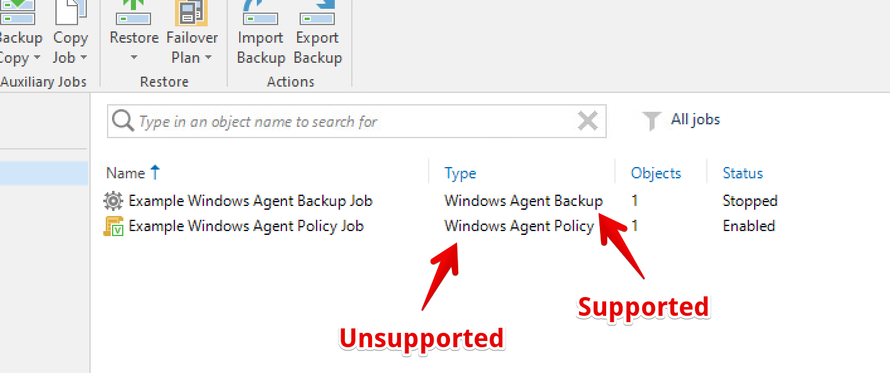

# VeeamNotify

Send Veeam Backup & Replication session summary notifications to Discord, Microsoft Teams, and Slack, detailing session result and statistics and optionally alerting you via mention when a job finishes in a warning or failed state.

VeeamNotify is a replacement for [VeeamDiscordNotifications](https://github.com/tigattack/VeeamDiscordNotifications) and the respective [Teams](https://github.com/tigattack/VeeamTeamsNotifications) and [Slack](https://github.com/tigattack/VeeamSlackNotifications) projects, featuring improvements across the board and support for all the aforementioned messaging services in one, easy to use project.

</img> </img> </img>

## Supported Notification Services

* Discord
* Slack
* Microsoft Teams

Please create a [feature request](https://github.com/tigattack/VeeamNotify/issues/new?assignees=tigattack&labels=enhancement&template=feature_request.yml&title=[FEAT]+New+service:+) if your preferred service isn't listed here.

## Supported Veeam Job Types

* VM Backup
* VM Replication
* Windows & Linux Agent Backup jobs*

### *Agent job support

Due to limitations in Veeam, only some types of Agent jobs are supported.

**Supported** jobs are known as "Agent Backup" or "Managed by backup server". **Unsupported** jobs are known as "Agent policy" or "Managed by agent". See the spoilered illustration below if this isn't clear to you.

Illustrated screenshot showing an example of supported types

</img>

**Note:** Linux Agent Backup jobs are also supported, this image is only an example.

You can read about the difference between these two Agent job types [here](https://helpcenter.veeam.com/docs/backup/agents/agent_job_protection_mode.html?ver=110#selecting-job-mode).

Unfortunately, even supported Agent jobs return a reduced amount of session information, so you won't see as much detail in the notification (see the example screenshots at the top).  
As much relevant information as I've been able to discover from such backup sessions is included in the notifications, but I welcome any suggestions for improvement in this area.

## Installation

Requirements:
* Veeam Backup & Replication 11 or higher.
* PowerShell 5.1 or higher.

Please see the [How to Install](https://github.com/tigattack/VeeamNotify/wiki/%F0%9F%94%A7-How-to-Install) wiki page.

## Configuration

Default configuration can be found in `C:\VeeamScripts\VeeamNotify\config\conf.json`

Details and examples can be found in the [Configuration Options](https://github.com/tigattack/VeeamNotify/wiki/%E2%9A%99%EF%B8%8F-Configuration-Options) wiki page.

---

## Credits

[MelonSmasher](https://github.com/MelonSmasher)//[TheSageColleges](https://github.com/TheSageColleges) for [the project](https://github.com/TheSageColleges/VeeamSlackNotifications) which inspired me to make this.  
[dantho281](https://github.com/dantho281) for various things - Assistance with silly little issues, the odd bugfix here and there, and the inspiration for and first works on the `Updater.ps1` script.  
[Lee_Dailey](https://reddit.com/u/Lee_Dailey) for general pointers and the [first revision](https://pastebin.com/srN5CKty) of the `ConvertTo-ByteUnit` function.  
[philenst](https://github.com/philenst) for committing or assisting with a number of core components of the project.  
[s0yun](https://github.com/s0yun) for the `Installer.ps1` script.  

Thank you all.
